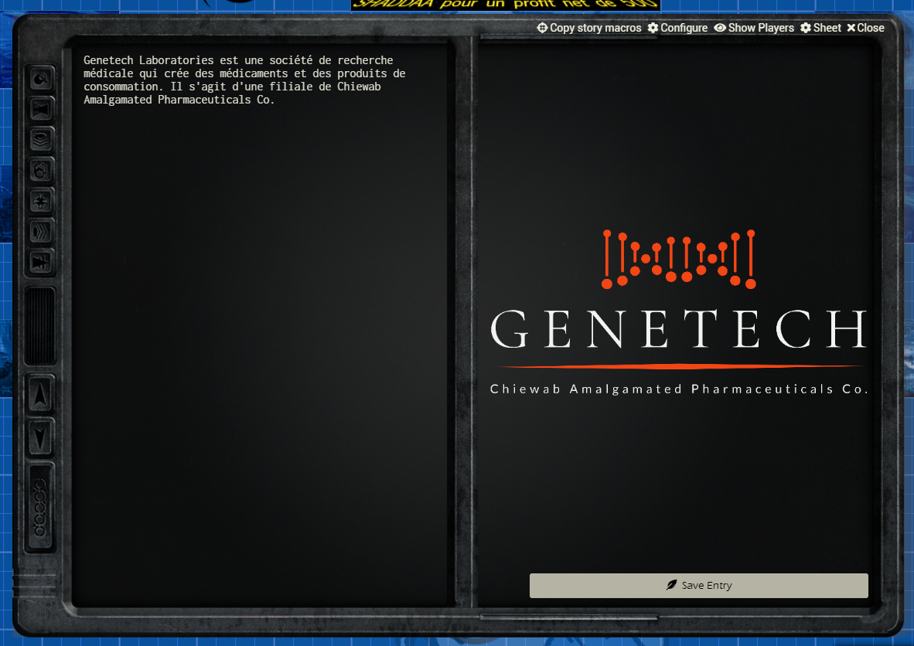
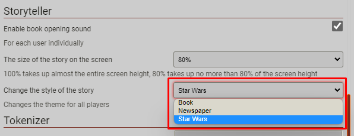
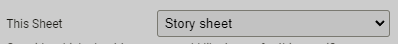

# Storyteller Star Wars theme for Foundry VTT

Adds a Star Wars datapad theme to the Foundry VTT Storyteller plugin.

## How it looks

## How to use it?

1. Go to the Storyteller module settings and choose the Star Wars theme, like this:
   

1. Then choose the Storyteller sheet:
   

1. Save sheet configuration

## Dependencies

This module requires [Storyteller for Foundry VTT](https://github.com/Xbozon/storyteller).

## Special thanks

The original datapad image was taken from [Reddit](https://www.reddit.com/r/swrpg/comments/6r7i9x/datapad_template/), thanks to [jaredisle](https://www.reddit.com/user/jaredisle/).
